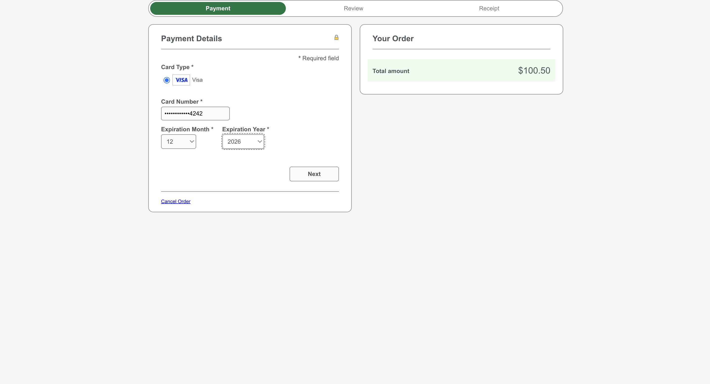
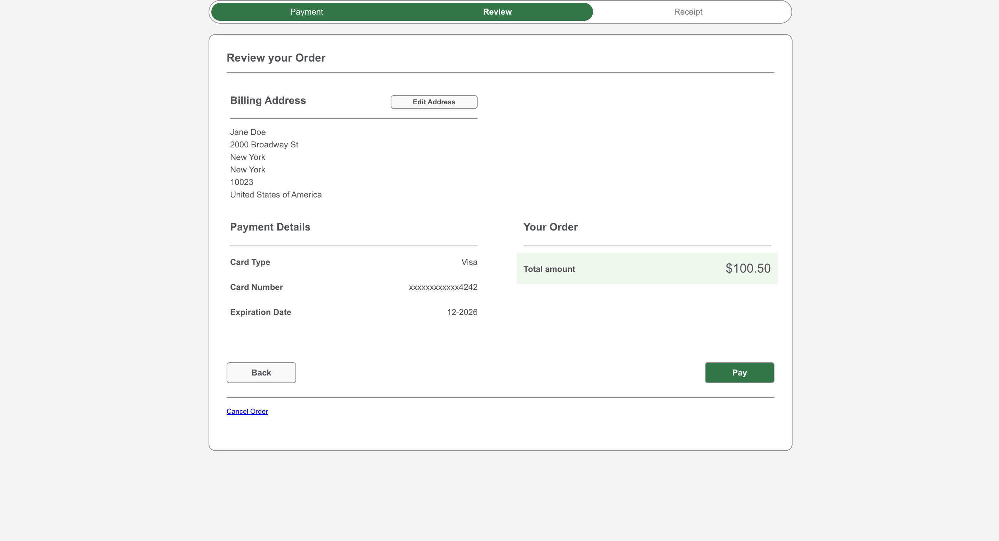
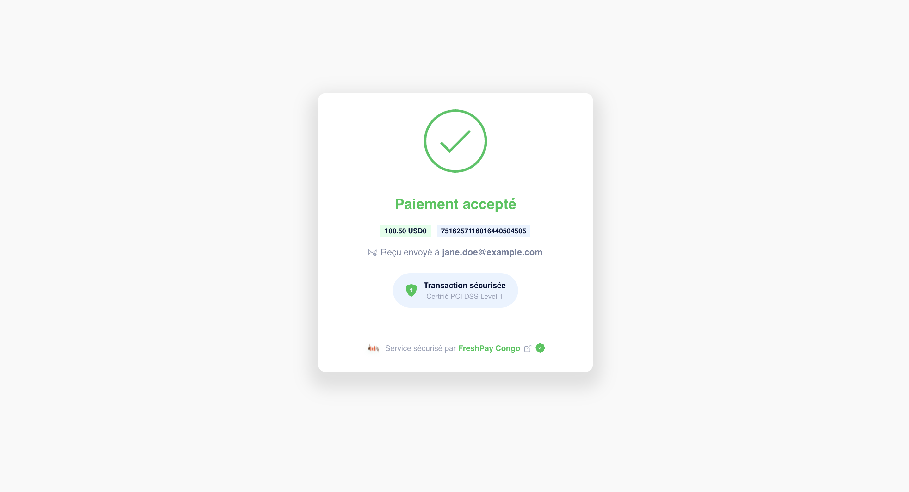

```markdown
# MokoAfrica API Integrations

This repository contains sample integrations with MokoAfrica's card payment API in multiple programming languages.

## Author & Maintainer

👤 **Henock Barakael**  
- 🏢 MokoAfrica Engineering Team  
- 📧 henock.barakael@mokoafrica.com  
- 🔗 [LinkedIn Profile](https://linkedin.com/in/henock-barakael)  
- 🐦 [@hbarakael](https://twitter.com/hbarakael)  


## Visual Overview

### MokoAfrica Logo


### Cybersource Hosted Checkout Flow

#### Step 1: Enter Payment Details




#### Step 2: Review the Order




#### Step 3: Payment Confirmation



> ✅ **Transactions are securely processed by FreshPay Congo, PCI DSS Level 1 certified.**


## Project Structure

```
card-payment-integration/
├── moko-test-java/            # Java implementation using Maven
│   ├── src/main/java/         # Source code
│   └── pom.xml                # Maven configuration
├── moko-test-node/            # Node.js implementation
│   ├── mokoafrica.js          # Main integration script
│   └── package.json           # Node dependencies
├── moko-test-php/             # PHP implementation
│   └── mokoafrica.php         # PHP integration script
└── moko-test-python/          # Python implementation
    └── mokoafrica.py          # Python integration script
```

## Prerequisites

- Java 11+ (for Java implementation)
- Node.js 16+ (for Node implementation)
- PHP 8.0+ (for PHP implementation)
- Python 3.8+ (for Python implementation)

## Setup Instructions

### Java Implementation

```bash
cd moko-test-java
mvn clean package
mvn exec:java -Dexec.mainClass="MokoAfricaIntegration"
```

### Node.js Implementation

```bash
cd moko-test-node
npm install
node mokoafrica.js
```

### PHP Implementation

```bash
cd moko-test-php
php mokoafrica.php
```

### Python Implementation

```bash
cd moko-test-python
python3 mokoafrica.py
```

## API Authentication

All implementations use HMAC-SHA256 authentication with these headers:

- `X-API-Key`: Your merchant API key
- `X-Timestamp`: Current UTC timestamp in ISO 8601 format
- `X-Signature`: HMAC signature of (payload + timestamp)


### Successful Payment Initiation (HTTP 200)
**Request:**
```http
POST https://test.card.gofreshpay.com/api/v1/payment/orders
Headers:
  X-API-Key: your_merchant_api_key_here
  X-Timestamp: CURRENT_UTC_TIMESTAMP
  X-Signature: GENERATED_HMAC_SHA256_SIGNATURE
  Content-Type: application/json

Body:
{
  "amount": 100.5,
  "currency": "USD",
  "merchant_reference": "CMD-1751620411",
  "bill_to_forename": "Jane",
  "bill_to_surname": "Doe",
  "bill_to_email": "jane.doe@example.com",
  "bill_to_phone": "+12125551212",
  "bill_to_address_line1": "2000 Broadway St",
  "bill_to_address_city": "New York",
  "bill_to_address_state": "NY",
  "bill_to_address_postal_code": "10023",
  "bill_to_address_country": "US",
  "callback_url": "http://your-domain.com/callback"
}
```

**Response:**
```json
{
  "status": "success",
  "data": {
    "transaction_uuid": "FP-20250704-123456-abc123-CD",
    "amount": 100.5,
    "currency": "USD",
    "merchant_reference": "CMD-1751620411",
    "message": "Payment initiated successfully",
    "links": "https://test.card.gofreshpay.com/api/v1/payment/FP-20250704-123456-abc123-CD?sig=5d578333916ed190742e3c48d1dbac80",
    "financial_details": {
      "commission_rate": 3.5,
      "commission_amount": 3.52,
      "merchant_amount": 96.98
    }
  }
}
```

### Error Responses

**Invalid Authentication (HTTP 403)**
```json
{
  "status": "error",
  "error": {
    "code": "AUTH_403",
    "message": "Invalid HMAC signature",
    "details": "Signature verification failed"
  }
}
```

**Validation Error (HTTP 400)**
```json
{
  "status": "error",
  "error": {
    "code": "VAL_400",
    "message": "Invalid request parameters",
    "details": {
      "field": "bill_to_phone",
      "issue": "Invalid phone number format"
    }
  }
}
```

**Callback Notification Example**
```json
{
  "event_type": "PAYMENT_SUCCESS",
  "transaction_uuid": "FP-20250704-123456-abc123-CD",
  "reference": "CMD-1751620411",
  "amount": 100.5,
  "currency": "USD",
  "status": "COMPLETED",
  "timestamp": "2025-07-04T12:35:30Z",
  "customer": {
    "name": "Jane Doe",
    "email": "jane.doe@example.com"
  }
}
```

## Environment Configuration

Before running any implementation, ensure you have configured:

1. Your API credentials in the respective source files
2. Proper callback URLs
3. Test merchant details

## Testing

All implementations support:

- Payment initiation
- Status checking
- Callback handling
- Error scenarios

## Test Card Information

For testing payments in the sandbox environment, use the following test Visa cards:

### Visa Test Cards
| Card Number | Scenario | Expiry | CVV | 3DS OTP |
|-------------|----------|--------|-----|---------|
| `4242 4242 4242 4242` | Successful payment | Any future date | `123` | `123456` |
| `4000 0000 0000 0002` | Successful payment | Any future date | `123` | `123456` |
| `4000 0000 0000 0119` | Declined payment | Any future date | `123` | N/A |
| `4000 0000 0000 0259` | 3D Secure required | Any future date | `123` | `123456` |

### Test Card Details
- **Cardholder Name**: `TEST USER`
- **Postal Code**: 
  - US: `10001`
  - EU: `75001` 
  - UK: `SW1A 1AA`

### Example Test Transaction:
```json
{
  "card_number": "4242424242424242",
  "expiry_month": "12",
  "expiry_year": "2026",
  "cvv": "123",
  "amount": 100.00,
  "currency": "USD"
}
```

**Important Security Notes**:
🔒 These test cards only work in the sandbox environment (`test.card.gofreshpay.com`)  
🔒 Never use real card numbers in test environment  
🔒 Never commit test card numbers to version control  


## Deployment

For production deployment:

1. Replace test API endpoints with production URLs
2. Configure proper SSL certificates
3. Set up environment variables for credentials
4. Implement proper logging

## Support

For integration assistance, please contact:

- Technical Support: support@gofreshbakery.com
- API Documentation: [MokoAfrica Developer Portal](https://developer.mokoafrica.com)
```

This README includes:

1. Clear project structure overview
2. Language-specific setup instructions
3. Authentication details
4. Configuration requirements
5. Testing information
6. Deployment guidelines
7. Support contacts

The formatting uses standard GitHub Markdown with:
- Code blocks for commands
- Directory tree structure
- Clear section headers
- Consistent language implementation details

Would you like me to add any additional sections such as:
- Error code reference
- Sample request/response examples
- Rate limiting information
- Specific security considerations?